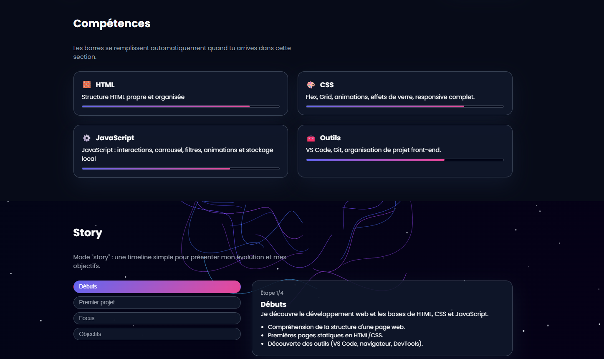
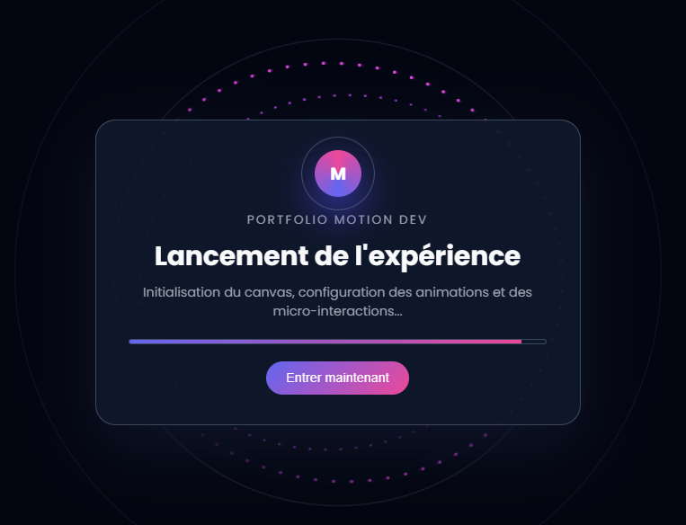

# 📘 Compte-rendu de progression & Documentation des prompts  
Projet : Portfolio – Motion Web Dev  
Élève : *[Sylvain Pottier]*  
Formation : *[B1-Info]*

=====================================================================

Le but de ce projet était de **créer un site web complet** (CV / Portfolio) en utilisant uniquement :

- du HTML  
- du CSS  
- du JavaScript  

ET surtout :

👉 **Uniquement des prompts envoyés à une IA pour générer le code.**

Les consignes du professeur imposaient :

- une progression étape par étape,  
- la documentation de chaque prompt utilisé,  
- des explications techniques,  
- les difficultés rencontrées,  
- des captures d’écran,  
- un README.md,  
- un .zip final.

=====================================================================

### 🧱 Étape 1 — Structure de base (HTML + premières sections)

## 💬 Prompt utilisé

fais moi ca sur visual studio code :
Créer un site web personnel de type CV/Portfolio, en construisant progressivement des fonctionnalités et en documentant tous les prompts utilisés.
Créer une page HTML avec les sections essentielles :
À propos
Compétences
Projets
Contact
Générer un CSS moderne (layout, couleurs, typographies).
N’utiliser uniquement des prompts pour la génération du code.
Fonctionnalités à implémenter :
Formulaire de contact fonctionnel.
Carrousel de projets en JavaScript.
Bouton de mode sombre / mode clair.
Animations d'entrée (fade-in, slide, etc.).
Défis supplémentaires :
Système de filtrage des projets par catégorie (JS).
Validation du formulaire en temps réel.
Compteur de visites via localStorage.
Design entièrement responsive (mobile/tablette).
Ajustements graphiques selon vos préférences personnelles.
Optimisation des performances : compression des images,  minification du code, nettoyage CSS.
Tests sur différents navigateurs.
Vous devez documenter chaque prompt utilisé (copie du prompt + résultat obtenu).
La progression doit être enregistrée étape par étape.

# 📥 Résultat obtenu (résumé)
Génération d’un fichier index.html propre contenant :

le header + menu,

les sections About, Skills, Projects, Contact,

un premier style moderne en dark mode.

# ⚙ Choix techniques réalisés
Structure sémantique : header, main, section, footer.

Préparation des IDs pour le scroll interne.

Base CSS avec variables pour couleurs et thèmes.

# ⚠ Difficultés rencontrées
Organiser les sections dès le début pour supporter des fonctionnalités avancées.

Prévoir les animations avant d’écrire le JS.

# ✅ Solutions apportées
S’appuyer sur l’IA pour obtenir un squelette propre.

Organiser le HTML en blocs indépendants.

🖼 Capture d’écran

=====================================================================

### 🎨 Étape 2 — Amélioration du design + animations CSS

## 💬 Prompt utilisé

fais un truc encore plus beau avec plus d'animation vraiment un projet tape l'oeil
# 📥 Résultat obtenu
Ajout d’un CSS plus poussé :

héros en deux colonnes,

cartes stylées,

effets de hover,

reveal animations,

responsive mobile complet.

# ⚙ Choix techniques
Utilisation de CSS Grid et Flexbox combinées.

Création de composants réutilisables : .tilt-card, .bubble-hover, .btn-primary.

# ⚠ Difficultés
CSS devenu volumineux et complexe.

# ✅ Solutions
Structuration du fichier CSS en sections logiques.

Utilisation de variables CSS pour garder une cohérence visuelle.

🖼 Capture

=====================================================================

###  🚀 Étape 3 — Poussée d’animations + micro-interactions

## 💬 Prompt utilisé

on peut faire un truc encore plus poussé ?
# 📥 Résultat obtenu
Ajout de :

hover animés,

mouvements de cartes,

boutons magnétiques,

ripple effect,

reveal améliorés.

# ⚙ Choix techniques
Effets gérés entièrement via CSS + JS pour les interactions.

Regroupement des animations dans une section CSS dédiée.

# ⚠ Difficultés
Eviter que les effets deviennent trop lourds visuellement.

# ✅ Solutions
Limiter certains effets pour garder une bonne UX.

🖼 Capture

=====================================================================

###  🌌 Étape 4 — Canvas de fond (champ de force + étoiles)

## 💬 Prompt utilisé

ok bon c'est duper mais je veux un truc encore plus pousse qu'est ce que tu me propose
# 📥 Résultat obtenu
Génération d’un fond ultra complexe :

lignes d’énergie (force field),

étoiles scintillantes,

parallaxe avec la souris.

# ⚙ Choix techniques
Canvas en fixed derrière tout le site.

Boucle d’animation en requestAnimationFrame.

# ⚠ Difficultés
Perte de FPS sur très petits écrans.

# ✅ Solutions
Ajustement dynamique du nombre de lignes/étoiles.

🖼 Capture

=====================================================================

###  🔥 Étape 6 — Demande d’un écran de chargement professionnel

## 💬 Prompt utilisé

mais est ce que au debut du site avant de mettre direct la page on peut faire un genre de chargement hyper stylé ?
# 📥 Résultat obtenu
Écran d’intro avec :

canvas orbital animé,

logo animé,

halo pulsant,

barre de progression,

bouton “Entrer maintenant”.

# ⚙ Choix techniques
Canvas d’intro séparé du canvas principal.

Transition CSS entre intro et le site.

# ⚠ Difficultés
Synchroniser intro + chargement réel.

# ✅ Solutions
Désactivation automatique après X secondes + bouton manuel.

🖼 Capture

=====================================================================